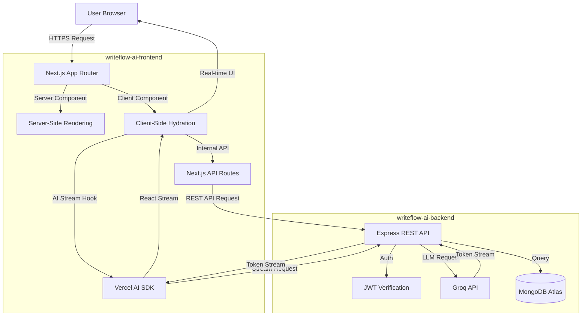
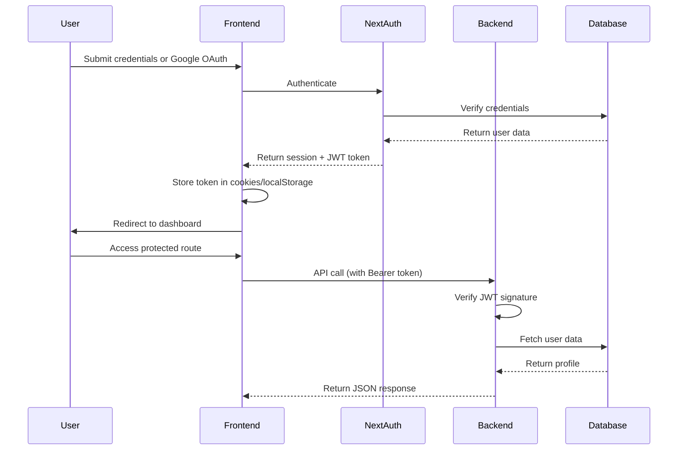

# ✍️ WriteFlow AI - AI-Powered Content Creation Platform

<div align="center">

**The all-in-one AI workspace for content creators, marketers, and businesses to generate, rewrite, and optimize content 10x faster**

[](https://nextjs.org/)
[](https://react.dev/)
[](https://www.typescriptlang.org/)
[](https://tailwindcss.com/)
[](https://sdk.vercel.ai/)
[](#-license--contributions)

<div align="center">
<a href="https://write-flow-ai-tau.vercel.app" target="_blank">

</a>
</div>

</div>

---

## 📋 Table of Contents

- [About The Project](#-about-the-project)
- [Real-World Problem & Solution](#-real-world-problem--solution)
- [Key Features](#-key-features)
- [Tech Stack](#️-tech-stack)
- [Software Architecture](#️-software-architecture)
- [Getting Started](#-getting-started)
  - [Prerequisites](#prerequisites)
  - [Installation](#installation)
  - [Environment Variables](#environment-variables)
- [Usage](#-usage)
- [Project Structure](#-project-structure)
- [Authentication & Security](#-authentication--security)
- [Database Schema](#-database-schema)
- [AI Agent System](#-ai-agent-system)
- [Performance & Responsive Design](#-performance--responsive-design)
- [Deployment](#-deployment)
- [Future Roadmap](#-future-roadmap)
- [Acknowledgments](#-acknowledgments)
- [License & Contributions](#-license--contributions)

---

## 🎯 About The Project

**WriteFlow AI** is a comprehensive AI-powered content creation platform that transforms how professionals create, refine, and manage content. Built on Next.js 14 with the Vercel AI SDK and powered by Groq's lightning-fast LLM infrastructure, WriteFlow delivers enterprise-grade content generation with sub-second response times.

### Why WriteFlow AI?

- **Intelligent AI Agents**: Purpose-built agents for drafting, rewriting, and chat assistance with context-aware responses
- **50+ Optimized Templates**: Pre-configured frameworks for blogs, emails, social media, ads, and more
- **Lightning-Fast Generation**: Groq-powered inference delivers complete blog posts in under 30 seconds
- **Real-Time Collaboration**: Team workspaces with shared templates and brand voice consistency
- **Complete Content Lifecycle**: From initial draft through refinement to export-ready copy
- **Role-Based Dashboards**: Separate interfaces for users, volunteers, and administrators
- **Advanced Analytics**: Track content generation, template usage, and team performance metrics

---

## 🧠 Real-World Problem & Solution

### The Problem

Content creation is a time-intensive bottleneck for modern businesses. Marketing teams, bloggers, and entrepreneurs face major challenges:

1. **Content Velocity Gaps** — Manual writing can't keep pace with multi-channel content demands (blogs, emails, social, ads)
2. **Inconsistent Brand Voice** — Different team members produce content with varying tone, style, and quality
3. **Editing Overhead** — Rewriting and optimizing existing content consumes as much time as creating new drafts
4. **Template Fragmentation** — Teams lack centralized, proven content frameworks that drive conversions
5. **No Content Analytics** — Zero visibility into what content performs best or how teams utilize resources

### The Solution

WriteFlow AI digitizes and accelerates the entire content pipeline:

- **Specialized AI Agents**: Draft Agent creates original content from scratch; Rewrite Agent refines existing text with tone controls; Chat Assistant provides contextual guidance
- **Template Library**: 50+ battle-tested frameworks for every content type, eliminating blank-page syndrome
- **Brand Voice Consistency**: Configurable tone, style, and voice parameters ensure all output matches your brand
- **Analytics Dashboard**: Real-time metrics track words generated, template performance, and user productivity
- **Collaborative Workspaces**: Teams share templates, maintain style guides, and review content together

---

## ✨ Key Features

### 🤖 AI Agent Ecosystem

#### ✍️ Draft Agent
- Generate long-form blog posts, landing pages, and articles from minimal prompts
- SEO-optimized structure with headers, subheadings, and keyword integration
- Configurable length, tone, and writing style parameters
- Real-time streaming output with word count tracking

#### 🔄 Rewrite Agent
- Transform existing text with tone modulation (professional, casual, friendly, persuasive)
- Expand or condense content while preserving core meaning
- Grammar and clarity optimization
- Side-by-side comparison view with original text

#### 💬 Chat Assistant
- Contextual Q&A for content strategy, SEO tips, and writing guidance
- Template recommendations based on use case description
- Multi-turn conversation memory for iterative refinement
- Export conversation history as markdown documentation

### 📚 Template Directory

- **Blog Content**: SEO long-form posts, listicles, how-to guides, thought leadership
- **Social Media**: Twitter threads, Instagram captions, LinkedIn posts, viral hooks
- **Email Marketing**: Cold outreach sequences, newsletter frameworks, promotional campaigns
- **Advertising**: Google Ads copy, Facebook ad scripts, landing page headlines
- **Business Documents**: Proposals, reports, executive summaries

### 🏢 Role-Based Dashboards

#### 👤 User Dashboard
- Personal content generation history with full-text search
- Saved drafts and works-in-progress
- Template favorites and recent usage
- Usage analytics (words generated, time saved)

#### 🛡️ Admin Dashboard
- System-wide statistics: total users, content generated, active sessions
- User management: review accounts, moderate content, assign roles
- Template management: create, edit, publish, and retire templates
- Content moderation queue for flagged outputs
- Platform health metrics and error monitoring

#### 🤝 Volunteer Dashboard
- Review community-submitted templates for quality
- Moderate user-generated content and feedback
- Assist with platform support and onboarding

### 📊 Advanced Analytics

- **Usage Metrics**: Words generated, templates used, active sessions, peak usage times
- **Performance Tracking**: Generation speed, API response times, error rates
- **User Insights**: Top content creators, most popular templates, retention metrics
- **Export Reports**: CSV/PDF download of analytics for external analysis

### 🔍 Content Management

- **Document Library**: Organize generated content with folders, tags, and categories
- **Version History**: Track iterations and revert to previous drafts
- **Export Options**: Download as Markdown, HTML, or plain text
- **Full-Text Search**: Instantly find past content by keyword or date range

### 🌐 Template Marketplace

- Browse public templates by category, popularity, and rating
- Community-contributed templates with usage statistics
- Detailed template previews with example outputs
- One-click template deployment to personal workspace

### 🎨 Advanced Features

- **Dark Mode Support**: Persistent theme toggle with `next-themes` integration
- **Responsive Design**: Fully adaptive from mobile (320px) to 4K displays
- **Real-Time Streaming**: Vercel AI SDK streams token-by-token output for immediate feedback
- **Keyboard Shortcuts**: Power-user navigation and agent invocation
- **Accessibility**: WCAG 2.1 AA compliant with screen reader support
- **Maintenance Mode**: Graceful degradation during platform updates with custom maintenance page

---

## 🛠️ Tech Stack

### Frontend (`writeflow-ai-frontend`)

- **[Next.js 14.2](https://nextjs.org/)** — React framework with App Router, server components, and streaming
- **[React 18](https://react.dev/)** — Concurrent rendering, Suspense, and server components
- **[TypeScript 5](https://www.typescriptlang.org/)** — Type safety across components, APIs, and utilities
- **[Tailwind CSS 3.4](https://tailwindcss.com/)** — Utility-first styling with custom design tokens
- **[Vercel AI SDK 6.0](https://sdk.vercel.ai/)** — Unified AI abstraction with streaming support (`useCompletion`, `useChat`)
- **[NextAuth.js](https://next-auth.js.org/)** — Authentication with Google OAuth support
- **[Prisma](https://www.prisma.io/)** — ORM for connecting to PostgreSQL

### Backend (`writeflow-ai-backend`)

- **[Node.js](https://nodejs.org/)** & **[Express](https://expressjs.com/)** — REST API framework
- **[TypeScript 5](https://www.typescriptlang.org/)** — Type safety
- **[Mongoose](https://mongoosejs.com/)** — MongoDB object modeling
- **[Groq SDK](https://groq.com/)** — Lightning-fast LLM inference with Llama models
- **[Passport.js](https://www.passportjs.org/)** — Authentication middleware (Google OAuth)
- **[jsonwebtoken](https://github.com/auth0/node-jsonwebtoken)** — JWT generation for API requests
- **[bcryptjs](https://github.com/dcodeIO/bcrypt.js)** — Password hashing

### UI Components

- **[Radix UI](https://www.radix-ui.com/)** — Unstyled, accessible component primitives
- **[Base UI React](https://base-ui.netlify.app/)** — Additional headless component library
- **[Lucide React](https://lucide.dev/)** — Beautiful, consistent icon system
- **[Sonner](https://sonner.emilkowal.ski/)** — Toast notifications with rich styling
- **[Recharts](https://recharts.org/)** — Composable charting library for analytics

### Styling & Animation

- **[class-variance-authority](https://cva.style/)** — Type-safe component variant system
- **[clsx](https://github.com/lukeed/clsx)** — Conditional className composition
- **[tailwind-merge](https://github.com/dcastil/tailwind-merge)** — Intelligent Tailwind class merging
- **[tailwindcss-animate](https://github.com/jamiebuilds/tailwindcss-animate)** — Animation utilities plugin

### Development Tools

- **[ESLint](https://eslint.org/)** — JavaScript/TypeScript linting with Next.js config
- **[PostCSS](https://postcss.org/)** — CSS transformation pipeline
- **[next-themes](https://github.com/pacocoursey/next-themes)** — Theme management with zero flicker

---

## 🏗️ Software Architecture

### Architecture Overview

WriteFlow AI operates as a decoupled system, utilizing two independent applications within the monorepo:
1. **Frontend (`writeflow-ai-frontend`)**: A Next.js 14 application using the App Router for UI, routing, and server-side rendering.
2. **Backend (`writeflow-ai-backend`)**: A Node.js Express application handling the REST API, AI integrations, and core business logic.



### Key Data Flows

#### AI Content Generation Flow

```
User enters prompt in Draft Agent
↓
Client component calls useChat hook (Vercel AI SDK)
↓
Frontend sends request to Backend API with system prompt + user message
↓
Groq API processes request (llama-3.1-70b-versatile)
↓
Token-by-token stream returns to client
↓
React component updates UI in real-time with streaming text
↓
Final output saved to MongoDB via Backend API
```

#### Authentication & Authorization Flow

```
User submits credentials on /login
↓
Frontend sends credentials to Backend API → Backend validates against MongoDB
↓
Backend returns JWT access token + refresh token
↓
Client stores tokens in httpOnly cookies (cookies-next)
↓
Subsequent API requests include Bearer token in Authorization header
↓
Backend middleware verifies JWT signature and decodes user role
↓
Role-based route guards render appropriate dashboard
```

### Component Architecture

```
App Root
├── RootLayout (Theme Provider + Auth Provider)
│   ├── Navbar (Global navigation + auth state)
│   ├── Public Routes
│   │   ├── Home (Hero, Features, Templates, Stats, FAQ, Newsletter)
│   │   ├── Login / Register
│   │   ├── Explore (Template Browser)
│   │   ├── Blog
│   │   ├── About
│   │   ├── Contact
│   │   └── Legal (Privacy, Terms)
│   └── Footer
└── DashboardLayout (Protected Routes)
    ├── DashboardSidebar (Collapsible nav + role-based menu)
    ├── MaintenanceGuard (Service window blocker)
    └── Dashboard Routes
        ├── User Dashboard
        │   ├── Draft Agent (DraftAgentClient)
        │   ├── Rewrite Agent (RewriteAgentClient)
        │   ├── Chat Assistant (ChatAgentClient)
        │   ├── Documents (DocumentsClient)
        │   ├── History (HistoryClient)
        │   ├── Templates
        │   ├── Analytics
        │   ├── Profile (ProfileClient)
        │   ├── Settings
        │   └── Support
        ├── Admin Dashboard
        │   ├── Analytics (AdminAnalytics)
        │   ├── Users (AdminUsersClient)
        │   ├── Templates (AdminTemplatesClient)
        │   ├── Reviews (AdminReviewsClient)
        │   └── Settings (AdminSettingsClient)
        └── Volunteer Dashboard
            └── (Moderation tools)
```

### Design Patterns

| Pattern | Implementation | Purpose |
|---------|---------------|---------|
| **Server Components** | Page layouts, static content sections | SEO optimization, reduced client bundle |
| **Client Components** | Interactive agents, forms, real-time UI | Stateful interactions, API calls |
| **Custom Hooks** | `useAuth`, `useTemplates`, `useAnalytics` | Reusable stateful logic |
| **Provider Pattern** | `AuthProvider`, `ThemeProvider` | Global state management |
| **Compound Components** | Template cards, analytics charts | Flexible, composable UI blocks |
| **Streaming UI** | AI agent outputs with `useChat` | Progressive content rendering |

---

## 🚀 Getting Started

### Prerequisites

Before you begin, ensure you have:

- **Node.js** (v18.0.0 or higher)
- **npm** (v9.0.0 or higher) or **yarn** (v1.22.0+)
- A **Groq account** with API key (for AI inference)
- Access to a **MongoDB** database (local or Atlas) for the backend
- Access to a **PostgreSQL** database (e.g., Supabase) for the frontend

### Installation

1. **Clone the repository**

```bash
git clone https://github.com/SiratimMChy/Writeflow-AI.git
cd Writeflow-AI
```

2. **Setup Backend**

```bash
cd writeflow-ai-backend
npm install
```

Create a `.env` file based on the example and configure your variables (e.g., MongoDB URI, Groq API key, JWT secrets):
```bash
cp .env.example .env
```

3. **Setup Frontend**

```bash
cd ../writeflow-ai-frontend
npm install
```

Create a `.env` file based on the example and configure your variables (e.g., Supabase Postgres URL, NextAuth secrets, Stripe keys):
```bash
cp .env.example .env
```

4. **Start the development servers**

In the backend directory:
```bash
npm run dev
```

In the frontend directory (open a new terminal):
```bash
npm run dev
```

5. **Open your browser**

Navigate to `http://localhost:3000` to view the application.

### Environment Variables

For security reasons, actual environment variables are not provided here. Please refer to the `.env.example` files in both the `writeflow-ai-frontend` and `writeflow-ai-backend` directories for a complete list of required environment variables and instructions on how to obtain them.

---

## 📖 Usage

### Getting Started with WriteFlow AI

1. **Create an Account**
   - Navigate to `/register`
   - Provide name, email, and password
   - Verify email (if backend email service configured)

2. **Explore Templates**
   - Visit `/explore` or click "Explore Templates" from homepage
   - Browse by category: Blog, Social Media, Email, Business
   - Preview template details, usage stats, and ratings

3. **Generate Content with Draft Agent**
   - From dashboard, navigate to **Draft Agent**
   - Select a template or start from scratch
   - Enter your prompt (e.g., "Write a blog post about sustainable fashion trends")
   - Adjust parameters: tone, length, creativity
   - Click "Generate" and watch AI stream your content in real-time

4. **Refine with Rewrite Agent**
   - Navigate to **Rewrite Agent**
   - Paste existing text or import from documents
   - Choose transformation: expand, condense, change tone, simplify
   - Review side-by-side comparison and accept changes

5. **Organize Your Work**
   - Save drafts to **Documents** with folders and tags
   - View generation history in **History** tab
   - Search past content by keyword or date
   - Export as Markdown, HTML, or plain text

6. **Track Performance**
   - Visit **Analytics** to see words generated, time saved
   - Review most-used templates and peak productivity times

7. **Admin Controls** *(Admin only)*
   - Access **Admin Dashboard** for system-wide metrics
   - Manage users: review accounts, assign roles, block spam
   - Curate templates: publish, feature, or retire content frameworks
   - Monitor platform health and API usage

### Key Routes

| Route | Description |
|-------|-------------|
| `/` | Landing page with features, templates, and newsletter |
| `/login` | Authentication page |
| `/register` | New user registration |
| `/explore` | Public template browser with filters |
| `/blog` | Platform blog and content marketing tips |
| `/about` | Company mission, team, and values |
| `/contact` | Support contact form |
| `/dashboard` | Main user dashboard overview |
| `/dashboard/draft` | AI Draft Agent interface |
| `/dashboard/rewrite` | AI Rewrite Agent interface |
| `/dashboard/chat` | Chat Assistant for Q&A |
| `/dashboard/documents` | Document library and management |
| `/dashboard/history` | Generation history log |
| `/dashboard/templates` | Personal template collection |
| `/dashboard/analytics` | Usage statistics and insights |
| `/dashboard/profile` | Account settings and preferences |
| `/dashboard/admin/*` | Admin-only management panels |
| `/privacy` | Privacy policy |
| `/terms` | Terms of service |
| `/maintenance` | Maintenance mode fallback page |

---

## 📁 Project Structure

```
writeflow-ai/
├── writeflow-ai-frontend/       # Independent Next.js frontend application
│   ├── public/                  # Static assets
│   ├── src/                     # Source code
│   │   ├── app/                 # Next.js App Router pages
│   │   ├── components/          # React components
│   │   └── lib/                 # Utility functions and API clients
│   ├── prisma/                  # Prisma schema and migrations
│   ├── package.json             # Frontend dependencies
│   └── tailwind.config.ts       # Tailwind CSS configuration
│
├── writeflow-ai-backend/        # Independent Node.js Express backend application
│   ├── src/                     # Source code
│   │   ├── config/              # Configuration files
│   │   ├── middlewares/         # Express middlewares
│   │   ├── modules/             # API modules (controllers, routes, services)
│   │   └── server.ts            # Entry point
│   ├── package.json             # Backend dependencies
│   └── tsconfig.json            # TypeScript configuration
│
└── README.md                    # This file
```

---

## 🔒 Authentication & Security

### Authentication Flow



### Security Layers

1. **Password Hashing** — `bcryptjs` secures stored credentials
2. **JWT Authentication** — Token-based authentication via NextAuth.js
3. **Session Cookies** — Secure cookie storage for session management
4. **Google OAuth** — Optional social login integration
5. **Role-Based Access Control (RBAC)** — Middleware validates user roles before rendering admin/volunteer-only routes
6. **API Route Protection** — All `/dashboard/*` API calls require valid Bearer token
7. **Environment Variable Isolation** — Sensitive keys stored in `.env`, never committed to version control

### Authentication Context

```typescript
// Authentication is handled by NextAuth.js and custom auth provider
// Token storage uses cookies-next for client-side token management
import { getCookie } from 'cookies-next'

// Tokens are also backed up in localStorage for persistence
const token = getCookie('token') || localStorage.getItem('token')
```

---

## 💾 Database Schema

The application utilizes a dual-database architecture:
1. **PostgreSQL** (via Supabase & Prisma) for the frontend (NextAuth user sessions, accounts, and Stripe billing).
2. **MongoDB** (via Mongoose) for the backend (storing application data like Templates, Documents, History, and Reviews).

> **Note**: The schemas below represent the primary data structures. The backend uses Mongoose collections, while the frontend relies on Prisma SQL models.

### Users Collection

```json
{
  "_id": "ObjectId",
  "name": "string",
  "email": "string (unique index)",
  "password": "string (bcrypt hash)",
  "role": "string (user | volunteer | admin)",
  "avatar": "string (URL or null)",
  "preferences": {
    "theme": "string (light | dark)",
    "defaultTone": "string",
    "language": "string"
  },
  "usage": {
    "wordsGenerated": "number",
    "templatesUsed": "number",
    "lastActive": "ISODate"
  },
  "createdAt": "ISODate",
  "updatedAt": "ISODate"
}
```

### Templates Collection

```json
{
  "_id": "ObjectId",
  "title": "string",
  "description": "string",
  "category": "string (Blog | Email | Social Media | Business)",
  "prompt": "string (System prompt for AI)",
  "thumbnail": "string (URL or null)",
  "usageCount": "number",
  "rating": "number (0-5)",
  "tags": ["array of strings"],
  "isPublic": "boolean",
  "isFeatured": "boolean",
  "createdBy": "ObjectId (User ref)",
  "createdAt": "ISODate",
  "updatedAt": "ISODate"
}
```

### Documents Collection

```json
{
  "_id": "ObjectId",
  "userId": "ObjectId (User ref)",
  "title": "string",
  "content": "string (Markdown)",
  "type": "string (draft | rewrite | chat)",
  "templateId": "ObjectId (Template ref, nullable)",
  "wordCount": "number",
  "folder": "string",
  "tags": ["array of strings"],
  "metadata": {
    "model": "string (llama-3.1-70b-versatile)",
    "tokensUsed": "number",
    "generationTime": "number (ms)"
  },
  "createdAt": "ISODate",
  "updatedAt": "ISODate"
}
```

### History Collection

```json
{
  "_id": "ObjectId",
  "userId": "ObjectId (User ref)",
  "action": "string (draft_generated | text_rewritten | chat_message)",
  "prompt": "string",
  "output": "string",
  "templateId": "ObjectId (Template ref, nullable)",
  "metadata": {
    "model": "string",
    "tokensUsed": "number",
    "parameters": "object"
  },
  "timestamp": "ISODate"
}
```

### Reviews Collection

```json
{
  "_id": "ObjectId",
  "userId": "ObjectId (User ref)",
  "templateId": "ObjectId (Template ref)",
  "rating": "number (1-5)",
  "comment": "string",
  "status": "string (pending | approved | rejected)",
  "moderatedBy": "ObjectId (User ref, nullable)",
  "createdAt": "ISODate",
  "updatedAt": "ISODate"
}
```

---

## 🤖 AI Agent System

### Draft Agent

**Purpose**: Generate original long-form content from minimal user prompts.


**Features**:
- Configurable parameters: tone (Professional, Casual, Enthusiastic, Informative, Persuasive)
- Template-based generation support
- Real-time token streaming with progress indicator
- Auto-save to Documents collection
- Word count tracking and copy functionality

### Rewrite Agent

**Purpose**: Transform existing text with tone modulation and structural improvements.

**Transformation Modes**:
- **Fix Grammar**: Correct grammar and spelling errors
- **Shorten**: Reduce word count while keeping key points
- **Lengthen**: Expand content with additional details
- **Professional**: Convert to formal, business-appropriate tone
- **Casual**: Make text more conversational and friendly


### Chat Assistant

**Purpose**: Provide contextual Q&A, content strategy advice, and template recommendations.

**Capabilities**:
- Multi-turn conversations with context preservation
- Real-time streaming responses
- Content strategy guidance and writing tips
- Brainstorming and ideation support


---

## ⚡ Performance & Responsive Design

### Performance Optimizations

1. **Server Components** — Static pages render server-side for better SEO and performance
2. **Code Splitting** — Dynamic imports for heavy components
3. **Image Optimization** — Next.js `<Image>` component with automatic optimization
4. **Streaming SSR** — Suspense boundaries for progressive rendering
5. **Groq Speed** — Fast LLM inference powered by Groq
6. **Skeleton Loaders** — Loading states with animated placeholders
7. **Debounced Inputs** — Reduced API calls on user input

### Performance Metrics

> **Note**: Actual performance metrics depend on deployment configuration and network conditions. Optimize based on your specific requirements.

### Responsive Design

- **Mobile-First Grid** — Tailwind responsive breakpoints (sm: 640px, md: 768px, lg: 1024px, xl: 1280px, 2xl: 1536px)
- **Collapsible Sidebar** — Dashboard nav collapses to icon-only mode on mobile
- **Touch-Friendly Targets** — All interactive elements ≥44px tap target
- **Fluid Typography** — `clamp()` CSS functions scale text smoothly across viewports
- **Adaptive Layouts** — Grid columns collapse from 4 → 2 → 1 on smaller screens
- **Dark Mode** — Persistent theme toggle with `next-themes`, no flash of unstyled content
- **Accessibility** — Keyboard navigation, ARIA labels, focus visible states, 4.5:1 contrast ratios

---

## 🌐 Deployment

### Frontend Deployment (Vercel)

1. **Connect Repository**
   - Log into [Vercel Dashboard](https://vercel.com/dashboard)
   - Import GitHub repository
   - Select `writeflow-ai` directory as root

2. **Configure Environment Variables**
   - Add `NEXT_PUBLIC_API_URL` and `GROQ_API_KEY`
   - Navigate to **Settings → Environment Variables**

3. **Deploy**
   ```bash
   git push origin main
   ```
   Vercel auto-deploys on every push to `main` branch

4. **Custom Domain** (Optional)
   - Add custom domain in Vercel project settings
   - Update DNS records with provided nameservers

### Backend Deployment (Render / Railway)

When deploying the `writeflow-ai-backend` directory, ensure:
- MongoDB Atlas connection string is configured
- CORS origin includes your frontend domain
- JWT secret is set in environment variables

### Docker Deployment

```bash
# Build image
docker build -t writeflow-ai .

# Run container
# Ensure you provide your actual backend API URL and Groq API key via an environment file.
docker run -p 3000:3000 \
  --env-file .env \
  writeflow-ai
```

Or use Docker Compose:
```bash
docker-compose up -d
```

---

## 📈 Future Roadmap

> **Note**: This roadmap represents planned features and is subject to change based on priorities and user feedback.

### Planned Features

- [ ] **Multi-Language Support** — Internationalization for global users
- [ ] **Team Workspaces** — Collaborative content creation
- [ ] **Advanced Analytics** — Detailed usage tracking and insights
- [ ] **Template Marketplace** — Community-contributed templates
- [ ] **API Access** — Programmatic content generation
- [ ] **Mobile Apps** — Native iOS and Android applications
- [ ] **WordPress Plugin** — Direct publishing integration
- [ ] **Browser Extension** — Generate content in any web form

---

## 🙏 Acknowledgments

- [Next.js Documentation](https://nextjs.org/docs) — Comprehensive framework guides
- [Vercel AI SDK](https://sdk.vercel.ai/) — Unified AI abstraction layer
- [Groq](https://groq.com/) — Ultra-fast LLM inference infrastructure
- [shadcn/ui](https://ui.shadcn.com/) — Beautiful, accessible component library
- [Tailwind CSS](https://tailwindcss.com/) — Utility-first CSS framework
- [Framer Motion](https://www.framer.com/motion/) — Production-ready animations
- [Lucide Icons](https://lucide.dev/) — Consistent, customizable icon set
- [Radix UI](https://www.radix-ui.com/) — Unstyled, accessible primitives
- [MongoDB Atlas](https://www.mongodb.com/atlas) — Cloud-hosted database
- [Recharts](https://recharts.org/) — Composable charting library

---

## 📄 License & Contributions

This project is open-source and welcomes contributions. Anyone is free to view, explore, and contribute to this repository. However, proper credit and attribution must be given to the original creator.

Distributed under the **MIT License**. See `LICENSE` file for more information.

### Contributing

We welcome contributions! Please follow these guidelines:

1. Fork the repository
2. Create a feature branch (`git checkout -b feature/AmazingFeature`)
3. Commit your changes (`git commit -m 'Add some AmazingFeature'`)
4. Push to the branch (`git push origin feature/AmazingFeature`)
5. Open a Pull Request

### Code of Conduct

- Write clean, documented code following existing patterns
- Ensure all tests pass before submitting PRs
- Respect user privacy and data security
- Be respectful in discussions and code reviews

---

*Copyright © 2026 WriteFlow AI. All rights reserved.*

<div align="center">

**Made by Siratim Mustakim Chowdhury**

[](https://github.com/SiratimMChy)
[](https://www.linkedin.com/in/siratim-mustakim-chowdhury/)
[](mailto:chowdhurysiratimmustakim@gmail.com)

</div>